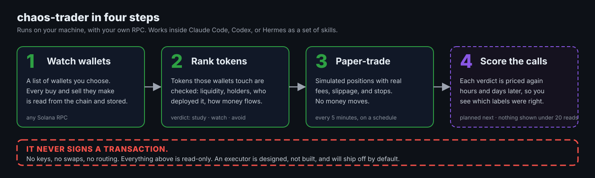
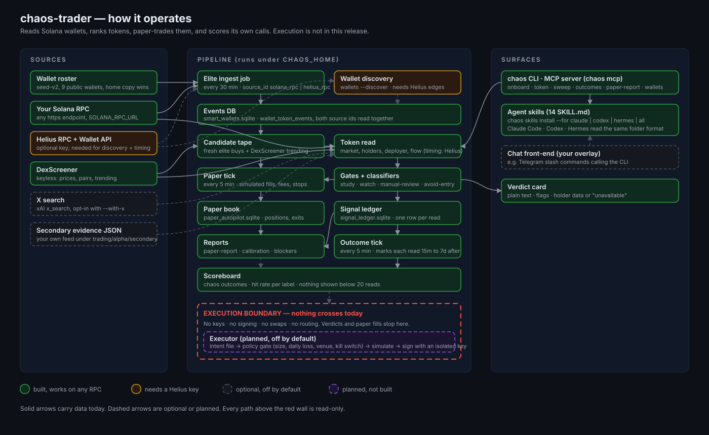

# chaos-trader


A trader-agent research stack for Solana: reads wallets, ranks tokens, runs paper trading, and ships agent skills. This release does not sign, route, or send transactions.

## 60-second path

    pip install git+https://github.com/AIEngineerX/chaos-trader
    export CHAOS_HOME="$HOME/.chaos-trader"
    chaos onboard --yes
    chaos token So11111111111111111111111111111111111111112 --no-x

That prints a verdict card; the rest of this page explains what is behind it. The token read takes a few seconds on the public RPC; the first ingest is the slow step.

## What it does



1. Reads transactions for a list of wallets (the roster) through your Solana RPC and stores them in `smart_wallets.sqlite`, and reports when a tier A or B wallet is among the token's sampled largest holders; tier C wallets count as scouts in the analysis file, not in the card's Q count. Any https Solana RPC works for that read. A Helius RPC adds two things: the transaction history of a token mint (first-touch timing and launch activity), and, with `HELIUS_API_KEY` set, the wallet discovery queue. The table under Configuration says which command needs what.
2. Builds a tape of the tokens those wallets bought, with market data from DexScreener.
3. Runs each token through structural gates (liquidity, holder concentration, deployer flags, flow) and labels it: study, watch, manual-review, or avoid-entry. The paper loop then decides enter, wait, or avoid. Nothing in this package says buy or sell.
4. Opens and closes simulated positions on those verdicts and keeps the accounting in SQLite.
5. Lets an agent that reads `SKILL.md` files (Claude Code, Codex, Hermes) call all of the above as tools.

It does not sign, route, or send anything. There is no switch to turn that on.

## Install

Install from GitHub:

    pip install git+https://github.com/AIEngineerX/chaos-trader

Releases are published to PyPI by the tag workflow; until the first tag, install from GitHub.

From source:

    git clone https://github.com/AIEngineerX/chaos-trader
    cd chaos-trader
    pip install -e .

Check:

    chaos --version

On Windows the `chaos` console script lands in the user Scripts folder, which may not be on `PATH`. `python -m chaos_trader.cli` is equivalent: use it in place of `chaos` everywhere below.

## Install for Hermes

The repository is also a Hermes profile. Installing it as one gives you `SOUL.md`, a `config.yaml` with a model block, the 14 skills, and four cron jobs. It needs Hermes 0.21.0 or later.

    hermes profile install github.com/AIEngineerX/chaos-trader --alias

The installer shows the manifest and four optional variables: `SOLANA_RPC_URL`, `HELIUS_API_KEY`, `XAI_API_KEY`, and `X_SEARCH_PROVIDER`. It asks once whether to go ahead. It does not ask for values: it lists the four in `.env.EXAMPLE` in the profile as commented-out lines with their defaults, and prints the profile path. `--alias` adds a `chaos-trader` command that runs `hermes -p chaos-trader`. The profile is named `chaos-trader`, not `chaos`, because Hermes names that wrapper after the profile, and a `chaos` wrapper could hide this package's own `chaos` command.

Then, once, install the package into the Python that Hermes runs on, and create the state folders in the profile:

    <Hermes python> -m pip install git+https://github.com/AIEngineerX/chaos-trader
    <Hermes python> -m chaos_trader.cli onboard --home <profile path> --yes

On a git install of Hermes, its Python is in the `venv` folder of the install directory that `hermes --version` prints. `onboard --yes` writes `.env` with the public RPC URL; add `--rpc-url <url>` or `--helius-key <key>` to use your own. It creates `trading/` with the seed roster, the paper config, and the data folders, and leaves `SOUL.md`, `config.yaml`, `skills/`, and `cron/` as they are. After that the agent needs no extra setup: Hermes sets `HERMES_HOME` to the profile folder for the agent and every command it runs, and `chaos` uses it as its home. A `CHAOS_HOME` in the environment Hermes starts from would win over it, so leave that unset.

The model block in the shipped `config.yaml` points at a local OpenAI-compatible server, `http://127.0.0.1:8080/v1`, with a placeholder model name. Run `hermes -p chaos-trader model`, or edit `config.yaml`, to pick a provider. Hermes needs a model with a context window of at least 64K tokens.

The four cron jobs ship paused: the elite ingest every 30 minutes, the paper tick every 5 minutes, the paper report once a day, and the outcome tick every 5 minutes. Each one is a prompt that asks the agent to run one `chaos` command, so every tick is a model call. `hermes -p chaos-trader cron list` hides paused jobs; `hermes -p chaos-trader cron list --all` shows them. Start one with its id:

    hermes -p chaos-trader cron resume chaos-paper-tick

Jobs fire only while the Hermes gateway is running; there is no separate cron daemon. `hermes -p chaos-trader cron status` says whether it is running and how to start it.

On install, Hermes copies the whole repository into the profile folder, except names it keeps for itself such as `.env`, `memories/`, and `sessions/`. That copy of the code is not used: `chaos` runs from the package you installed with pip. `hermes profile update chaos-trader` fetches the repository again and replaces every top-level file and folder it ships, including `SOUL.md`, `skills/`, and `cron/`. It keeps `config.yaml` unless you pass `--force-config`, and does not touch `.env` or `trading/`. Because `cron/` is replaced, jobs you resumed are paused again after an update.

What was run on a Hermes host, and what it printed, is Round 5 in `docs/verification-2026-10-01.md`. That round installed from a local checkout under another profile name, without `--alias`. The Hermes install from the GitHub URL needs the repository to be reachable from your machine; the local-directory install is verified in Round 5. A local-checkout install also copies `.git` and untracked files into the profile.

## First run

Point `CHAOS_HOME` at the folder before the first `chaos` command. The installed skills and the cron lines below refer to it, so it has to match what `chaos onboard` creates.

    export CHAOS_HOME="$HOME/.chaos-trader"

In PowerShell:

    $env:CHAOS_HOME = "$HOME\.chaos-trader"

Then:

    chaos onboard

This asks two questions: an optional Helius API key, then your RPC URL (any https Solana JSON-RPC endpoint; the public one works for a first look). If you give a key, leave the URL blank so reads go through Helius. It then creates `CHAOS_HOME` (default `~/.chaos-trader`) with `.env` holding the answers, the seed roster, the paper config, and the data folders. The code stays in the installed package; the home holds state only. Onboard writes `.env` once. If a `.env` is already there before the first onboard, for example a Hermes profile's own, onboard adds the keys that are missing, leaves the ones that are set, and prints one line for each. It also prints the home it resolved and the command to run next, with that home in it. On a home that is already set up, onboard says so, points at `chaos update`, exits 1, and changes nothing.

Then:

    chaos token So11111111111111111111111111111111111111112

prints a verdict card for one mint. And:

    chaos sweep --limit 5

pulls DexScreener's trending and boosted Solana tokens, ranks the top five, and runs a deep read on the best one. `chaos sweep --fast` instead ranks the tokens the roster wallets bought in the last 45 minutes and the mints the last `chaos sweep` ranked, from the local database, with no live reads. `chaos help` lists every verb the command accepts, including `onboard`, `update`, `skills`, `run`, `paper-report`, and `smart-signals`.

`chaos run <script> [args]` runs any pipeline script, job, or skill helper in the package by its file name without `.py`, for example `chaos run smart_wallet_tracker <wallet address>`. `chaos run` alone lists the names and exits 2.

Six commands read data they do not fill themselves. On a fresh home, four of them print one plain sentence and exit 0 instead of a card, `chaos token --fast` prints an "alpha tape unavailable" card, and `chaos outcomes` prints a card that says `NO SCORES YET` and shows no rate:

| Command | What it reads | Filled by |
|---|---|---|
| `chaos sweep --fast` | Roster buys from the last 45 minutes in `trading/db/smart_wallets.sqlite`, and the mints the last `chaos sweep` ranked | The elite ingest job fills the roster buys. The live `chaos sweep` writes one `token_signals` row for each mint it ranks, and a concentration snapshot for that mint when the RPC served its largest-holders read. With no buy in that window and no sweep yet it lists no candidates. The freshness line says fresh while the newest roster event is under 35 minutes old (the ingest runs every 30), the newest sweep row is under 15 minutes old, and the newest snapshot is under an hour old. That takes both writers: one fresh ingest and one `chaos sweep`. A sweep alone still reads stale, and since the sweep is manual its rows go stale 15 minutes later. Roster events count from their time on chain, so a quiet roster reads stale too. The public RPC does not serve the largest-holders read, so no snapshot is written there and the line keeps saying concentration stale. |
| `chaos token --fast <mint>` | That mint's wallet events, its newest sweep row, and its newest concentration snapshot in `smart_wallets.sqlite` | The elite ingest job and `chaos sweep`, as above. It needs both: after one fresh ingest and one sweep, while those rows are fresh, the verdict is no longer `stale-tape` on a keyed RPC. A sweep alone still gives `stale-tape`, as a live run on the public RPC showed. On the public RPC it stays `stale-tape` either way, because concentration stays stale. |
| `chaos paper-report` | `trading/db/paper_autopilot.sqlite` | the paper tick |
| `chaos outcomes` | `trading/db/signal_ledger.sqlite`: the token reads and the marks taken after each one | Token reads: each `chaos token`, `chaos analyze token`, `chaos strategy-paper`, deep read in `chaos sweep`, and paper-tick read writes one row. The outcome tick marks each read 15m, 1h, 4h, 24h, 3d, and 7d after it. Until the tick has run, the card says `Outcome tick has not run` |
| `chaos wallets --discover 5` | the discovery queue in `smart_wallets.sqlite` | the Helius wallet API, through `chaos run smart_wallet_tracker <wallet address>` on a Helius RPC with `HELIUS_API_KEY` set; the ingest job does not fill it |
| `chaos wallets --review` | Each roster wallet's events, positions, and newest tracker score in `smart_wallets.sqlite` | The elite ingest job. Until its first completed run the command prints `No ingest yet`. Scores come from `chaos run smart_wallet_tracker` |

## Configuration

Everything lives in one folder, `CHAOS_HOME`. The `chaos` verbs write only under `CHAOS_HOME` (plus `chaos skills install`, which writes the harness skill folders it prints, and `--force` can replace a same-named skill folder there). Scripts run through `chaos run` default to `CHAOS_HOME` but write wherever their own output flags (`--db`, `--out`, `--out-dir`, `--report-dir`, `--root`, `--out-prefix`, `--evidence-db`) or the `CHAOS_*_ROOT` env overrides point. `CHAOS_HOME/trading/cache/holders/` keeps the last largest-holder sample for each mint and sample size read on a keyed RPC and is safe to delete. The public RPC never fills it, because it does not serve that read. A sample a keyed RPC cached in the last 15 minutes is still used when a later read of that mint fails, including the public RPC's not-served refusal. A file there that does not read as a sample is ignored, and a cache that cannot be written does not fail the read.

Which commands work on which RPC:

| Command | Works on any RPC | Needs Helius |
|---|---|---|
| `chaos token` | Yes. Watch-wallet hits need the holder sample, which is the 20 largest accounts plus a small sample. The public RPC does not serve the 20 largest accounts at all (`HOLDERS: unavailable (not served by this RPC)`), so only the small sample is matched there, and watch wallets among the largest holders need a keyed RPC. On a keyed RPC with a short rate limit, holder reads retry three times and then use a sample cached in the last 15 minutes, if any. A token read on its own never confirms wallet timing; only the paper autopilot supplies a first touch | Only for the mint's transaction history: first-touch timing and launch activity come back unavailable without it |
| `chaos analyze token` | Yes | Same as `chaos token` |
| `chaos sweep` | Yes | Same as `chaos token` |
| `chaos strategy-paper` | Yes: it runs the token analysis itself, so it needs no earlier output | Same as `chaos token` |
| `chaos sweep --fast` | Yes, from the roster buys of the last 45 minutes that the ingest job writes and the rows `chaos sweep` writes to `smart_wallets.sqlite` | The freshness line reaches fresh only on an RPC that serves the largest-holders read, because only that read gives `chaos sweep` a concentration snapshot to write |
| `chaos token --fast` | Yes, from the mint's wallet events, sweep row, and concentration snapshot in `smart_wallets.sqlite` | Same as `chaos sweep --fast`: on the public RPC the verdict stays `stale-tape` |
| `chaos paper-report` | Yes, from `paper_autopilot.sqlite` once the paper tick has run | No |
| `chaos outcomes` | Yes | No |
| `chaos wallets` | Yes, status and queue from `smart_wallets.sqlite` | No |
| `chaos wallets --discover` | No | Yes: its queue is fed by the Helius wallet API, which needs a Helius RPC and `HELIUS_API_KEY`. Seed it with `chaos run smart_wallet_tracker <wallet address>` |
| elite ingest job | Yes, through the standard RPC path | No |
| paper tick | Yes | No |
| X evidence (`--with-x`) | Yes | No, needs an xAI key |
| `chaos run wallet_deep` | No | Yes: it calls the Helius wallet API, which needs `HELIUS_API_KEY` |

Wallet transactions read through a standard RPC are stored with `source_id` `solana_rpc`. Rows read through Helius carry `helius_rpc`. Every report reads both together.

X research is on by default for `token`, `analyze token`, `strategy-paper`, and `sweep` when a provider is configured: `XAI_API_KEY` alone is enough, and `HERMES_AGENT_SRC` is only for people who want Hermes's own tool and credentials. `--with-x` asks for it explicitly, and `--no-x` always turns it off. A SuperGrok or X Premium+ subscription login through Hermes gives answers without citations, which this package treats as no evidence. An xAI API key gives real posts and is metered.

Three rules hold for X evidence. An answer without sources never changes a verdict, adds a paper trigger, or sets an X risk flag. You are only charged against the X budget when a request was actually made. Asking for X with no provider configured is the same as X off, plus one line on stderr: `X search: no provider configured (set XAI_API_KEY or HERMES_AGENT_SRC)`.

| Variable | Default | What it does |
|---|---|---|
| `CHAOS_HOME` | `~/.chaos-trader` | The one folder for config, databases, and reports. `CHAOS_PROFILE_HOME` and `HERMES_HOME` are accepted as fallbacks for Hermes installs. |
| `SOLANA_RPC_URL` | none | Any https Solana JSON-RPC endpoint. Required unless `HELIUS_API_KEY` is set. Private-network hosts and http are rejected. It takes precedence over `HELIUS_API_KEY`; to switch an existing home to Helius, remove or replace the `SOLANA_RPC_URL` line in `.env`. |
| `HELIUS_API_KEY` | none | Optional. Alone, it is used to build a Helius RPC URL. `SOLANA_RPC_URL` takes precedence over the key. The wallet API calls (`chaos run smart_wallet_tracker`, `chaos wallets --discover`, `chaos run wallet_deep`) need this key even when `SOLANA_RPC_URL` points at Helius. The tracker and `chaos wallets --discover` also need the RPC itself to be Helius: on any other RPC they skip the wallet API and write no transfer edges. |
| `CHAOS_ALLOW_PRIVATE_RPC` | unset | When set to `1`, a private-network or local RPC host is accepted (still https only). This is how you use a self-hosted node. |

### Rarely needed

| Variable | Default | What it does |
|---|---|---|
| `CHAOS_PYTHON` | the interpreter running the command | The Python used for the child scripts that `chaos_cmd.py`, the paper autopilot, and the ingest job start. |
| `CHAOS_ALPHA_ROOT` | `CHAOS_HOME/trading/alpha` | Where `alpha_claim_ledger.py` reads and writes. Only that script reads it; the candidate tape and secondary evidence always use `CHAOS_HOME/trading/alpha`. |
| `CHAOS_WATCHLIST_ROOT` | `CHAOS_HOME/trading/watchlists` | The watchlist folder `alpha_claim_ledger.py` reads. Only that script reads it. |
| `CHAOS_JOURNAL_ROOT` | `CHAOS_HOME/trading/journals` | Where `paper_trade_journal.py` writes the paper trade journal. |
| `SMART_MONEY_API_BASE` | none | Base URL of an external smart-money signal API, https only. The `chaos-smart-money-signals` skill and `chaos smart-signals` do nothing without it. |
| `SMART_MONEY_API_TOKEN` | none | Bearer token for that signal API. Every signal read requires it. |
| `CHAOS_ALLOW_PRIVATE_SIGNAL_API` | unset | When set to `1`, a private-network or local host is accepted for `SMART_MONEY_API_BASE`. |
| `GMGN_API_KEY` | none | Read only by the optional GMGN cross-check, which is off by default. If unset, that adapter looks in `~/.config/gmgn/.env`. |
| `GMGN_CLI` | unset | Optional path to the `gmgn-cli` binary for the GMGN cross-check. If unset, `gmgn-cli` is looked up on `PATH`. Whatever executable you point it at is run, so point it only at a binary you trust. |
| `HERMES_AGENT_SRC` | unset | Optional. Path to a Hermes agent source checkout, for people who want Hermes's own X search tool and credentials. X search no longer needs it: `XAI_API_KEY` alone enables X. When set, the `hermes` provider is the default. |
| `X_SEARCH_PROVIDER` | `hermes` if `HERMES_AGENT_SRC` is set, else `xai` if `XAI_API_KEY` is set, else `none` | Which X search provider to use. `hermes` loads the X search tool from `HERMES_AGENT_SRC`. `xai` calls xAI's API directly with `XAI_API_KEY`. `none` turns X search off. Any other value counts as `none`. |
| `XAI_API_KEY` | none | xAI API key for the `xai` provider. It is redacted from printed output. The Grok CLI login token is not used, because it expires within hours. A SuperGrok or X Premium+ login through Hermes answers without citations, and an answer without citations counts as no evidence; with the API key, answers cite real posts, and use is metered. |
| `X_SEARCH_MODEL` | `grok-4.5` | The Grok model the `xai` provider asks. |
| `X_SEARCH_REASONING_EFFORT` | unset | `low`, `medium`, `high`, or `xhigh`, sent to the `xai` provider only when set. Unset, the model's own default applies. |
| `X_SEARCH_TIMEOUT_SECONDS` | `180` | How long the `xai` provider waits for one answer, at least 30. Complex searches can take one to two minutes. |
| `X_SEARCH_RETRIES` | `2` | How many times the `xai` provider retries after a server error, timeout, or broken connection, from 0 to 5; a larger value counts as 5. Each wait is 1.5 seconds longer than the last, up to 5 seconds. A rate limit or other client error is not retried. `0` turns retries off. Retries are cut so all attempts together fit in 500 seconds of timeout, so at the default 180-second timeout only 1 retry is made. |

Set them in `CHAOS_HOME/.env`. `chaos onboard` writes that file once. To add or change a key later, edit `.env` by hand; a `.env` that onboard wrote says so in its first line. A second `chaos onboard` on the same home does not touch it.

The paper-trading rules are in `CHAOS_HOME/trading/config/paper_autopilot.yaml`. That file is yours: `chaos update` never overwrites it, and instead writes the package's current defaults beside it as `paper_autopilot.defaults.yaml` so you can diff the two. Besides that defaults file, `chaos update` only restores a missing wallet schema file or data folder. Code updates come from pip, and the command prints the line:

    pip install -U git+https://github.com/AIEngineerX/chaos-trader

The defaults and the reason for each are in `docs/why-these-defaults.md`.

Every pipeline verb (`sweep`, `token`, `analyze`, `strategy-paper`, `paper-report`, `outcomes`, `smart-signals`, `wallets`) accepts `--json` and prints one envelope: `schema_version`, `command`, `generated_at`, `data`. `--raw` keeps the older unwrapped payload. The schema version changes only when a field's meaning changes. `--json` with `--raw` or `--render-json` exits 2. In the envelope, paths under the home read `$CHAOS_HOME` and the Helius and xAI keys are redacted. Where a verb has nothing to show yet and prints one sentence, `data` is `{"status": ..., "message": "<that sentence>"}` and the exit code stays 0. The status is `no-ingest` for `chaos sweep --fast` until the wallet database exists, which the ingest, `chaos sweep`, or `chaos wallets` creates, and for `chaos wallets --review` before the first ingest. Once that database exists, even before any ingest, `chaos sweep --fast --json` prints the tape payload, which lists the mints the last sweep ranked. The status is `no-wallet-db` for `chaos wallets --discover` before the wallet database exists. `chaos wallets --add` and `--remove` return `added` or `removed` the same way. `chaos wallets --discover --json` prints the envelope with `ok` false and exits 1 when any wallet it enriched failed, as `--raw` does.

## How it works



Green boxes work on any RPC, amber needs a Helius key, grey is optional and off by default, purple is planned and not built. Nothing crosses the red wall.

The wallet lane, from the seed roster to the paper book, is documented in `docs/smart-wallets.md`.

    roster.json
      -> wallet transaction reads (your RPC; Helius or any standard RPC)
      -> wallet_token_events in smart_wallets.sqlite
      -> candidate tape
      -> DexScreener market snapshot
      -> token, holder, and deployer reads (your RPC)
      -> gate and risk classifiers
      -> signal_ledger.sqlite
      -> paper_autopilot.sqlite (simulated positions)
      -> reports under trading/reports/

A second lane reads JSON files from `trading/alpha/secondary/` if you put any there. It is labeled secondary evidence. It can raise a token from avoid to study, and it is one of the inputs to watch and deep-check, which also need an observed on-chain first touch. It cannot by itself open a paper position: an entry also needs on-chain wallet timing, a credible catalyst, or X evidence (`strategy_paper_engine.py`).

## Skills

Each folder under `skills/blockchain/` in the repo is one `SKILL.md` an agent can load. The skills ship inside the wheel too. `chaos skills list` prints the names with one line each.

| Skill | What it gives the agent |
|---|---|
| `solana` | Raw reads: balances, token accounts, transactions, program context |
| `chaos-solana-intelligence` | Token and holder analysis with the verdict card |
| `chaos-crypto-trader` | What the read says about a token and the paper loop's plan for it; guidance; it runs `chaos token` and `chaos strategy-paper` |
| `chaos-alpha-decoder` | Reading the candidate tape; guidance, no command |
| `chaos-smart-money-signals` | Cluster and multi-wallet evidence from an external signal API (`SMART_MONEY_API_BASE`); no public provider exists today, so this skill is inactive without one |
| `chaos-wallet-attribution` | Funding and transfer graph reads |
| `chaos-position-aware-alpha` | Verdicts that account for tokens your own wallets hold |
| `chaos-risk-engine` | Structural gates and risk flags; guidance, no command |
| `chaos-paper-autopilot-operations` | Running and reading the paper loop |
| `chaos-trade-journal` | Paper outcomes and the learning report; guidance, no command |
| `chaos-execution-control` | The boundary: what the agent may and may not do |
| `gmgn-alpha-intelligence` | Optional cross-check against GMGN labels |
| `wallet-watchlist-imports` | Turning wallet lists into import files; guidance plus a validator; feeds `chaos wallets --add` |
| `chaos-evm-intelligence` | Reading EVM wallets, tokens, and contracts by hand; guidance, no command; Solana is the only chain the pipeline reads |

Install them for every supported agent in one command:

    chaos skills install --for all

`--for` also takes `claude`, `codex`, or `hermes`, and is required on every install, `--project` included: `chaos skills install --project` without it exits 2. `--dry-run` prints each destination and writes nothing. `--project` writes into the current repository instead of your home folder. Running it again updates the installed copies in place. Files that an older skill version had and the new one dropped are not removed. Each installed folder holds a `.chaos-trader-skill` file with the package version. A same-named folder without that file is someone else's skill: the command skips it and prints `skipped <path>: a skill with this name already exists (use --force to replace)`. `--force` replaces it.

- **Claude Code.** Writes `~/.claude/skills/<name>`, or `.claude/skills/<name>` with `--project`. Confirm with `ls ~/.claude/skills`, or `/skills` inside a Claude Code session.
- **Codex.** Writes `~/.agents/skills/<name>`, or `.agents/skills/<name>` with `--project`. Confirm with `ls ~/.agents/skills`. For a skill to run a `chaos` command, three things must hold inside Codex's shell. Its workspace-write sandbox blocks network by default: pass `-c 'sandbox_workspace_write.network_access=true'`, or set `network_access = true` under `[sandbox_workspace_write]` in `~/.codex/config.toml`. The `chaos` console script must be on `PATH`: export your venv's `bin` directory, or `Scripts` on Windows, before you start `codex`. `CHAOS_HOME` must reach the shell: a config with `shell_environment_policy.inherit = "core"` drops it, so pass `-c 'shell_environment_policy.inherit="all"'`. The run that needed all three is R2.7 in `docs/verification-2026-10-01.md`.
- **Hermes.** A profile install already holds the skills (see Install for Hermes), so Hermes users there do not need this command. For a Hermes setup without the profile, `--for hermes` writes `<Hermes home>/skills/blockchain/<name>`. The Hermes home is found in the order Hermes itself uses: `HERMES_HOME` if set, else `%LOCALAPPDATA%\hermes` on Windows if that folder exists, else `~/.hermes` if it exists. `chaos skills install --for hermes --dry-run` prints the folder it picked. When none of the three exists, the command installs into `~/.agents/skills` and prints a `skills.external_dirs` snippet to add to your Hermes `config.yaml`. Confirm with `hermes skills list`. With `--project`, Hermes reads `.agents/skills` only after you run `hermes skills trust` in that project. That command needs a git checkout: outside one it refuses with `Not inside a git checkout` and still exits 0, so read its output.

## Use it from an MCP agent

`chaos mcp` starts a stdio server named `chaos-trader` for any agent that speaks the Model Context Protocol (MCP). Each of its seven tools runs the same verb as the command line with `--json` and hands the agent that envelope, so the agent sees exactly what `chaos token --json` prints. The tools are `token_read`, `analyze_token`, `sweep`, `strategy_paper`, `wallets_review`, `paper_report`, and `roster_list`. No tool signs, sends, or edits the roster. The read tools write only what the same command-line verbs write under `CHAOS_HOME`: signal ledger rows, report files, the holder cache, and for `sweep` the fast-lane rows. Those ledger rows are reads that `chaos outcomes` later counts. Roster edits and the ingest stay on the command line on purpose. `token_read` and `analyze_token` take `with_x`, off by default; `sweep` and `strategy_paper` use X when a provider is configured, as the command line does. A malformed mint comes back as a tool error, and the server keeps running. The server needs an onboarded home and the `mcp` extra:

```bash
pip install "chaos-trader[mcp] @ git+https://github.com/AIEngineerX/chaos-trader"
```

A token read can take several minutes, so the Codex and ElizaOS entries raise their tool timeouts above the 620-second limit of `chaos analyze`. Where `chaos` is not on the agent's `PATH`, use `python` as the command with `-m chaos_trader.cli mcp` as the arguments.

Claude Code:

```bash
claude mcp add --env CHAOS_HOME="$HOME/.chaos-trader" --transport stdio chaos-trader -- chaos mcp
```

Codex, in `~/.codex/config.toml`:

```toml
[mcp_servers.chaos-trader]
command = "chaos"
args = ["mcp"]
tool_timeout_sec = 660

[mcp_servers.chaos-trader.env]
CHAOS_HOME = "~/.chaos-trader"
```

Cursor, in `.cursor/mcp.json` for one project or `~/.cursor/mcp.json` for all of them:

```json
{
  "mcpServers": {
    "chaos-trader": {
      "command": "chaos",
      "args": ["mcp"],
      "env": { "CHAOS_HOME": "~/.chaos-trader" }
    }
  }
}
```

ElizaOS, in the character file, per the plugin-mcp README (https://www.npmjs.com/package/@elizaos/plugin-mcp):

```json
{
  "plugins": ["@elizaos/plugin-mcp"],
  "settings": {
    "mcp": {
      "servers": {
        "chaos-trader": {
          "type": "stdio",
          "command": "chaos",
          "args": ["mcp"],
          "env": { "CHAOS_HOME": "~/.chaos-trader" },
          "timeoutInMillis": 660000
        }
      }
    }
  }
}
```

## Running it on a schedule

Seven job wrappers ship in the package; run each with `chaos run <name>`. Each one prints a short result. The ingest, the three paper wrappers that write a database, and the outcome tick take a lock, so two copies of the same job never run at once.

| Wrapper | What it does |
|---|---|
| `chaos_alpha_elite_ingest` | Reads recent transactions for the roster wallets into `smart_wallets.sqlite`. |
| `chaos_paper_autopilot_tick` | One bounded discover, decide, and monitor pass of the paper autopilot, which keeps `paper_autopilot.sqlite`. Accepts `--with-x`. |
| `chaos_alpha_elite_paper_tick` | One cycle of the elite-cohort paper book, reading `smart_wallets.sqlite` and writing `alpha_elite_paper.sqlite`. |
| `chaos_alpha_elite_paper_cycle` | The same cohort cycle, repeated `--max-cycles` times with `--interval-seconds` between runs; the default is one cycle. |
| `chaos_paper_learning_tick` | Runs `chaos paper-report` once, which reads the paper book and writes a JSON report under `trading/reports/paper_learning/`. |
| `chaos_wallet_discovery_tick` | Runs `chaos wallets --discover 5`. Needs `HELIUS_API_KEY` for the wallet API. |
| `chaos_outcome_tick` | Marks every read in `signal_ledger.sqlite` whose 15m, 1h, 4h, 24h, 3d, or 7d horizon is due, with DexScreener's price, and writes `trading/state/outcome_tick_last_run` after a clean run. A mark taken more than 5 minutes after its horizon is recorded late and never counted. `chaos outcomes` reads these marks. |

Add the elite ingest and the paper tick to your own cron to keep the tape and the paper book fresh, and the outcome tick so `chaos outcomes` has marks to count. Run the outcome tick every 5 minutes: a mark counts only when it is taken within 300 seconds of its horizon, so a slower tick loses marks for good. Add `chaos_paper_learning_tick` the same way if you also want the daily paper report, the third job the Hermes profile ships:

    */30 * * * * CHAOS_HOME=$HOME/.chaos-trader /path/to/your/venv/bin/chaos run chaos_alpha_elite_ingest
    */5  * * * * CHAOS_HOME=$HOME/.chaos-trader /path/to/your/venv/bin/chaos run chaos_paper_autopilot_tick
    */5  * * * * CHAOS_HOME=$HOME/.chaos-trader /path/to/your/venv/bin/chaos run chaos_outcome_tick

Replace `/path/to/your/venv/bin/chaos` with the `chaos` script in the venv you installed chaos-trader into; `which chaos` prints it after you activate the venv. Cron does not activate a venv, so a bare `chaos` may not be found.

Hermes users: the profile ships these three jobs and a daily paper report as Hermes cron jobs; see Install for Hermes.

On Windows, Task Scheduler does the same job. Use the full path to the interpreter you installed into (`python -c "import sys; print(sys.executable)"` prints it):

    schtasks /create /sc minute /mo 30 /tn chaos-ingest /tr "<python> -m chaos_trader.cli run chaos_alpha_elite_ingest"

If a path contains spaces, wrap it in `\"` inside the `/tr` value. Task Scheduler does not read your shell's `CHAOS_HOME`. Either keep the default home, or run `setx CHAOS_HOME <CHAOS_HOME>` once so tasks inherit it.

The ingest works on any RPC. On the public RPC, which is rate limited, a wallet takes one to three minutes, so the nine seed wallets do not fit the job's 540-second bound: one measured run read five of them before the bound stopped it with exit 124. The rows already read stay in `smart_wallets.sqlite`. Each run reads the wallets with no completed ingest first, then the one whose last completed read is oldest, so the next run starts with the wallets the bound cut off and a few runs cover the whole roster; transactions already stored are not stored twice. To read the whole roster in every run, use a Helius RPC. The ingest, the paper tick, and the outcome tick each return the exit code of the script they wrap. The ingest exits 2 when any wallet read fails, so a cron mailer will report it, and 124 when it times out. The paper tick exits 1 when any candidate's analysis raised an error, non-zero when the autopilot run fails, and 124 when it times out; it exits 0 when it skips because a prior tick still holds the lock. The outcome tick exits 2 when DexScreener did not answer for a read that was due, whose mark is then recorded missing, and 124 when it times out; it exits 0 without writing its stamp, and prints one line saying it skipped, when a prior tick still holds the lock. Its 540-second bound is longer than its 5-minute interval, so a tick that runs long makes the next ones skip; a mark that falls due meanwhile is lost for good once the next tick reaches it more than 5 minutes after its horizon.

## Keeping it current

Run `chaos wallets --review` once a week. It reads `smart_wallets.sqlite` only, never the chain, and prints one line for each wallet in your roster with a label:

- `dormant`: the wallet has no stored event in the last 14 days, or none at all. `--days N` changes the window.
- `no track record yet`: the wallet has recent events but fewer than three clean closed positions.
- `scoring`: the wallet has three or more clean closed positions.

`no track record yet` is normal in the first days after an ingest. The ingest builds the track record: each run rebuilds the wallet's positions, and a clean closed position is one the wallet has sold in full, with no transfer or low-confidence event mixed into its accounting.

Scoring a wallet is a separate step: `chaos run smart_wallet_tracker <address>`. On a Helius RPC with `HELIUS_API_KEY` set, it also pulls the wallet's transfer edges. Until a wallet is scored, its score shows `-`, and a `scoring` wallet says `not scored yet` with that command.

To replace a `dormant` wallet, run `chaos wallets --add <new address> --tier A|B|C`, then `chaos wallets --remove <old address>`. Both edit `trading/config/roster.json` only and never call the chain, and `chaos wallets --list` prints that file's wallets with their tiers. You can also edit that file by hand: change the address, set the tier, and add nothing else. Then run the ingest again. Tiers never change on their own, and no score edits the roster.

A roster wallet that carries a hard flag in any watch file is left out of token reads. A promoter `avoid` verdict also leaves it out unless the same wallet has an actor label from the secondary lane, which takes precedence. `chaos wallets --review` still lists the wallet, so check the promoter output if a wallet you expect never shows as a hit.

Three cron jobs keep the data fresh. The ingest refreshes the stored events and positions. The paper tick refreshes the paper book. The outcome tick marks each token read at its horizons. The Hermes profile ships four: these three and the daily paper report, which writes the daily summary. Elsewhere, you can add `chaos run chaos_paper_learning_tick` to your cron the same way as the other three.

`chaos outcomes` shows how past reads did at one horizon after the read, 24h unless `--window` names another. For each read label it gives the median price change and the share of reads that went up, doubled, or fell 70% or more. For `avoid-entry` and `exit-liquidity-watch` it also gives the share caught: a fall of 70% or more, a pool under $1,000, or a pair gone from DexScreener. Only the first read of a mint and label on a UTC day counts, and only when the outcome tick marked it within 5 minutes of its horizon; when that first mark was late or missing, the day is not scored for them. A pair gone from DexScreener by then counts as a 100% fall. Reads of tokens your own wallets hold never appear. A label with fewer than 20 such reads shows its count and no rate; `--min-n` can raise that floor but not lower it. A public claim about how the reads did may quote this card and nothing else.

The seed roster is a starting set captured on the date in its `captured_at` field. It is not a recommendation.

To go back to an earlier release, install it by its tag: `pip install git+https://github.com/AIEngineerX/chaos-trader@v<version>`. That does not touch `CHAOS_HOME`, so `.env`, the roster, and your paper config stay as they are.

## Execution

Not in this release. This package labels tokens study, watch, manual-review, or avoid-entry; its paper loop decides enter, wait, or avoid; and for tokens your own wallets hold it reports a position state (hold-core, manage, trim-risk, or exit-watch) that describes risk, not an instruction. It never says buy or sell, and it cannot sign, route, or send. There is no keypair handling and no swap routing. A later release adds a separate executor process that reads an intent file, checks it against a policy file (trade size, daily loss cap, venue allowlist, kill switch), simulates, and only then signs with an isolated keypair you fund yourself. It will ship off by default. Until then the paper loop and its boundary config in `trading/config/paper_autopilot.yaml` are the whole story.

## Security boundary

See `SECURITY.md` and `BOUNDARY.md`. Short version: the code reads public chain data through the RPC you configure and never stores wallet keys, signer material, seed phrases, or transaction-authority secrets. The `chaos` verbs write only under `CHAOS_HOME` (plus `chaos skills install`, which writes the harness skill folders it prints, and `--force` can replace a same-named skill folder there). Scripts run through `chaos run` default to `CHAOS_HOME` but write wherever their own output flags (`--db`, `--out`, `--out-dir`, `--report-dir`, `--root`, `--out-prefix`, `--evidence-db`) or the `CHAOS_*_ROOT` env overrides point. Optional API credentials such as Helius or xAI keys live only in your local `CHAOS_HOME/.env`. The optional GMGN cross-check, off by default, also reads `GMGN_API_KEY` from `~/.config/gmgn/.env` when the variable is unset. Do not put a funded keypair anywhere this package can read until the executor release says how.

## License

MIT. See `LICENSE`. The `solana` skill includes third-party MIT code; its attribution is in `NOTICE`. The Chaos character art in `docs/brand/` is CC BY 4.0: reuse it with the credit line in `docs/brand/LICENSE`.
