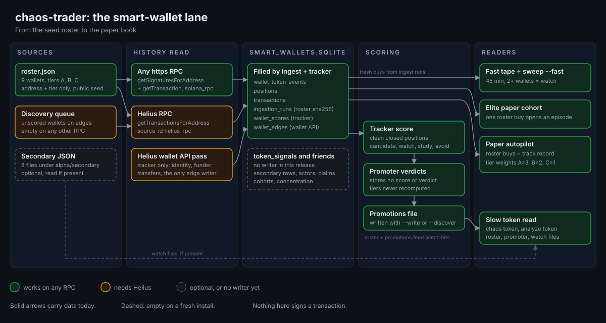

# How the smart-wallet lane works

This page follows a wallet from the seed roster to the paper book. It says what each step reads and writes in this release, and which parts of the lane have no input yet.

Green boxes work on any RPC, amber needs Helius, grey is optional or has no writer in this release.

## Where the wallets come from

The seed roster ships in the package at `chaos_trader/seed/roster.json`. It holds nine addresses, three in each of tiers A, B, and C. Each entry has two fields, `address` and `tier`. The file carries a version (`seed-v2`), a capture date, and `"source": "public"`. No entry says why the wallet is on the list.

`chaos onboard` copies the file to `CHAOS_HOME/trading/config/roster.json` once, and only if no copy is there. `chaos update` never touches it. After that the file changes only when you change it, and nothing in the package re-tiers a wallet.

To use your own wallets, run `chaos wallets --add <address> --tier A|B|C` and `chaos wallets --remove <address>`. Both edit the home roster only and never call the chain. They keep the file's fields, set its `source` to `user-edited`, and refuse a duplicate, an unknown address, and removing the last wallet. The `wallet-watchlist-imports` skill prepares a list from a CSV, JSON, or leaderboard export for `chaos wallets --add`. You can also edit `trading/config/roster.json` by hand. Keep a `wallets` list of objects with `address` and `tier`. The tier must be A, B, or C; a missing tier counts as C. The loader rejects an empty list, an address that is not base58, and duplicate addresses. For a one-off run, the ingest takes `--roster <file>`. The flag wins over the home copy, and the home copy wins over the package seed. Every ingest run records the roster's version and sha256.

The discovery queue lists wallets that share a funding or transfer edge with a wallet already in the database and have never been scored. Wallets whose category is exchange, cex, program, or bridge are left out, and the rest are ranked by edge count. The edges come only from the Helius wallet API pass of `smart_wallet_tracker`: one funded-by edge and one edge per transfer with a counterparty. The ingest writes no edges. On any other RPC the tracker skips the wallet API, so the queue stays empty.

Eight JSON files under `trading/alpha/secondary/` are read as watch-wallet lists if they are present. They are optional, and `chaos onboard` creates the folder empty. One of them, `wallet_initial_review.json`, is written by `chaos run wallet_watchlist_initial_review` from a wallet list you put at `trading/watchlists/wallets.json`. At its default `--out-prefix`, nothing in this package writes the other seven. With `--out-prefix wallet_all_active_review` or `--out-prefix wallet_deep_pass_review`, the same review writes that file instead.

The token read also reads an optional file of your own wallets: `trading/watchlists/owner_wallets.json` under the home, the path `OWNER_WALLETS_PATH` names in `token_event_analyzer.py`. Nothing in the package creates it, `chaos onboard` included. It is one JSON object with a `wallets` key. That key holds either a list of objects, each with the address in `wallet` or `address`, or an object keyed by address. Each entry may also carry a `label` and a `role`. A file that does not parse counts as empty. For each listed wallet, the token read asks the RPC for that wallet's balance of the mint. A balance above zero marks position exposure on the card: the `OWNER POSITION READ` header on a `chaos token` card, an `OWNER:` line, and the private position note, and the `WALLETS:` line counts the hits. The same addresses are masked in saved token artifacts and in the signal ledger. Nothing else uses it except that masking. It does not feed discovery, scoring, or the paper book. This is the position the `chaos-position-aware-alpha` skill means: its verdicts account for tokens your own wallets hold, not for open paper positions.

## How a wallet's history is read

`chaos run elite_wallet_pipeline ingest` reads each roster wallet's recent transactions through your RPC. On any https RPC it pages `getSignaturesForAddress`, then calls `getTransaction` once per signature with a short pause between calls. On a Helius endpoint (`mainnet.helius-rpc.com`) it calls `getTransactionsForAddress` instead. That method also returns transactions that touch only the wallet's token accounts, so the standard path can miss some incoming SPL transfers. Rows read the standard way carry `source_id` `solana_rpc`, and rows read through Helius carry `helius_rpc`. Every reader takes both.

`--history-limit` defaults to 50 transactions per wallet and `--pages` to 1. A page holds at most 100.

Each wallet gets one row in `ingestion_runs`. Its notes carry the wallet's tier and the roster's version and sha256. Each transaction becomes events:

- `buy` when a token balance rises and SOL falls, counting native and wrapped SOL together.
- `sell` for the reverse.
- `token_transfer_in` or `token_transfer_out` when the token moves without SOL going the other way.
- Pure SOL moves and failed transactions get their own types.

A buy or sell gets `medium` confidence only when the transaction touches one non-SOL mint. Every other token row is `low`. SOL-move and failed rows carry no confidence of their own and are stored as `medium`, the default. Positions are then rebuilt per wallet and mint, with realized PnL in SOL matched at average cost. A token transfer, a low-confidence row, or a SOL move inside the position's trade window marks the position contaminated.

The scheduled wrapper, `chaos run chaos_alpha_elite_ingest`, runs the ingest with 50 and 1 and holds a file lock. It stops the ingest at 540 seconds and exits 124. Otherwise it returns the ingest's exit code, which is 2 when any wallet read fails. A run that finds the lock held prints one line and exits 0.

## What is stored

Everything lives in `trading/db/smart_wallets.sqlite`, created from `trading/schemas/smart_wallets_schema.sql`.

Tables the ingest and the tracker fill:

- `schema_meta`: the schema name and version, written by the schema file itself.
- `sources`: the two source ids, `solana_rpc` and `helius_rpc`. The live sweep adds a third, `chaos_sweep`.
- `ingestion_runs`: one row per wallet per run. Ingest rows carry the roster lineage in `notes`.
- `wallets`: one row per address. Identity and balance fields are filled only by the Helius wallet API pass.
- `transactions`: the raw transaction cache.
- `wallet_token_events`: the base fact table of buys, sells, transfers, SOL moves, and failed transactions.
- `positions`: one ledger row per wallet and mint.
- `tokens`: mints seen in events and in wallet API balances.
- `wallet_scores`: one row per tracker run on a wallet. The ingest does not write it.
- `wallet_edges`: funded-by and transfer edges, from the Helius wallet API pass only.

Tables the live sweep fills, for each mint `chaos sweep` ranks and no other:

- `token_signals`: one row of type `sweep-rank` per mint and 15-minute bucket, with source `chaos_sweep`. `wallet_count` is the number of roster wallets that bought the mint in the last 45 minutes, counted by the fast tape's rules; `tg_channel_count` is 0. A second sweep in the same bucket updates the row. `chaos token --fast`, `chaos sweep --fast`, and `mint_cluster_query` read it.
- `token_concentration_snapshots`: one row per mint and 15-minute bucket, only when the RPC served the largest-holders read or a sample of it was cached in the last 15 minutes. `supply_pct` is the top-20 share held by wallets and unclassified accounts, after pools, programs, and burn addresses are taken out; `holder_count` stays empty, because no read here counts holders. The public RPC does not serve that read, so on it this table gets no rows, and `chaos token --fast` keeps saying concentration stale there; the `token_signals` rows and `chaos sweep --fast` work on any RPC. The 10-row token-account sample the public RPC does serve cannot stand in: its rows come in arbitrary order, not largest first, and its `total` is the page size, not a holder count. `chaos token --fast` and `mint_cluster_query` read it.

The elite ingest writes neither table. One bounded ingest on the public RPC took 454 seconds of its 540 and touched 58 mints, so a holder read for each of them does not fit inside the bound.

Tables with no writer in this release:

- Secondary evidence: `wallet_scores` and `wallet_token_events` rows with `source_id` `secondary_export`. The promoter and `mint_cluster_query` read them.
- Shared-mint edges: `wallet_edges` rows of type `shared_mint_overlap`. The promoter reads them.
- `actors` and `actor_wallets`: operator clusters. The promoter, `mint_cluster_query`, and `wallet_quality_report` read `actors`.
- `token_signals` rows of any type but `sweep-rank`, such as historical multi-buy signals with Telegram channel counts.
- `token_concentration_snapshots` for mints the sweep did not rank, and holder counts for any mint.
- `token_cohorts`: cohort rows. `wallet_ledger_mapper` reads it.
- `alpha_claims`, `source_scores`, and the notes search tables. Nothing reads them either.

## How wallets are scored and tiered

`chaos run smart_wallet_tracker <wallet>` scores one wallet. It first deletes that wallet's earlier on-chain events, positions, scores, and edges. Then it reads the history again, rebuilds positions, and scores the wallet from its clean closed positions: closed, not contaminated, and with a known realized PnL.

    score = clamp(realized PnL in SOL x 4, -40, 40)
          + win rate x 25
          + min(15, 2 x clean closed positions)
          - 2 x contaminated positions

A wallet with no positions scores 0. The score sets a copyability label:

- `candidate`: score 65 or more, at least 3 clean closed positions, and no contaminated ones.
- `watch`: score 45 or more, and contaminated positions no more than half the positions (at least 1 is allowed).
- `avoid`: score below 15. A wallet with no positions gets `unknown` instead.
- `study`: everything else.

The result is one row in `wallet_scores`. The tracker does not score entry timing, hold time, or consistency.

`chaos run smart_wallet_promoter` ranks every wallet that has a `wallet_scores` row, plus the primary wallet of any actor. It counts only tracker rows from the current scoring version. It starts at 0 and adds or subtracts:

| Evidence | Change |
|---|---|
| Actor label `copyable-candidate`, `deep-watch`, or `high-churn-scout` | +12 |
| Secondary all-time PnL above 100,000 | +8 |
| Secondary 50 or more buys with 20 or more sells / with fewer than 5 sells | +8 / -10 |
| Tracker buys plus sells: 10 or more / none | +10 / -12 |
| Tracker realized PnL above 2 SOL / below -1 SOL | + / - twice the PnL, at most 18 |
| Tracker contamination 0.25 or less / 0.75 or more | +15 / -20 and a hard flag |
| Tracker copyability `candidate` or `watch` / `avoid` | +12 / -14 |
| No tracker row | -15 |
| 3 or more clean trade positions with 2 or more clean closed | +18 |
| 3 or more trade positions, none clean | -12 |
| 3 or more wins | +8 |
| At least 3 losses and twice as many losses as wins | -8 |
| Most mints shared with one wallet: 40 or more / 20 or more | +18 / +8 |
| 40 or more shared mints plus one of those actor labels | score raised to at least 48 |
| No trade positions but transfer edges | -10 |

The total is clamped to 0 through 100. The actor, secondary, and shared-mint lines read rows that nothing in this release writes, so they stay at zero. The verdicts:

- `smart-wallet-candidate`: 70 or more, no hard flag, and at least 3 clean closed positions.
- `cluster-sensor`: 52 or more, or 42 or more with 40 or more shared mints.
- `study`: 35 or more.
- `low-priority`: 18 or more.
- `avoid`: below 18.

The promoter prints its ranking. With `--write` it also writes `trading/alpha/smart_wallet_promotions.json` and a Markdown copy. It stores no score or verdict in the database. When it opens the database, it applies the schema and upserts the two `sources` rows. `chaos wallets` runs the promoter and writes those files only with `--discover`.

Tiers come from the roster file and are never recomputed. No score or verdict changes the roster.

## How the wallet lane reaches a token read and the paper book

**The fast tape.** `chaos sweep --fast` ranks elite buys. These are `buy` events from ingest runs, with medium or high confidence, from the last 45 minutes. At most three mints count per wallet, and mints are ranked by how many distinct wallets bought them. Two or more wallets on one mint are enough for a `watch` label. Three or more are reported as a multi-buy cluster. After those it lists the mints of the newest `token_signals` rows, which are the mints the live `chaos sweep` ranked. The tape reads as fresh when the newest roster event and the newest `token_signals` row are under 15 minutes old and the newest concentration snapshot is under an hour old. Otherwise `chaos token --fast` gives `stale-tape`. Roster events count from their time on chain, so the tape goes stale when the roster has not traded for 15 minutes, even right after an ingest. On the public RPC the sweep writes no concentration snapshot, so the tape stays stale there.

**The elite paper cohort.** `chaos run elite_paper_cohort cycle` keeps its own book in `alpha_elite_paper.sqlite`. It reads roster wallets' ingest buys that arrived after its cursor; the first run puts the cursor at the newest stored event, so only later buys count. One buy opens an episode. Other roster wallets buying the same mint within 15 minutes are recorded but not required. Among its checks, it rejects a buy older than 45 minutes and a token with under $25,000 of liquidity.

**The paper autopilot.** `chaos run chaos_paper_autopilot_tick` seeds its candidates from the same fast tape and, with `market_discovery.enabled` (on in the shipped config), up to five DexScreener trending or boosted tokens per tick. To confirm a candidate through the wallet lane, it reads ingest buys of that mint from the last 45 minutes. Each buy must come from a completed run that recorded a roster version and matching sha256. Each wallet behind those buys must have its own track record in `positions`:

- at least 3 clean closed positions,
- total realized PnL above 0 SOL,
- a win rate of at least 0.4 across them.

Wallets that pass are weighted by tier: A=3, B=2, C=1. The shipped `paper_autopilot.yaml` needs one such wallet and a weight of 1. When the wallet lane confirms a candidate and the token read puts it in conviction trench mode, the autopilot passes the first elite buy time to the gate as the first touch and runs the gate again.

**The slow token read.** `chaos token` and `chaos analyze token` take watch wallets from the home roster, the eight secondary files, and the promotions file. The roster is read once per run. Roster tiers A and B count as quality hits, and tier C as a scout hit. The promoter's `smart-wallet-candidate` verdict counts as a quality hit and `cluster-sensor` as a scout hit; its other three verdicts give no hit. Rows that `wallet_watchlist_initial_review` tiers `deep-first` or `watch` count as quality hits, and `sample` counts as a scout hit. A negative verdict or a hard flag on an address in any watch file removes that address's roster entry only; entries for the same address from the other files still count. Each quality hit counts toward the card's `WALLETS: Q` number, and any quality hit adds 4 to the read's score. On a fresh install the roster is the only watch file present, so its nine wallets are the watch set. In this package, three commands write a watch file: `chaos onboard` writes the roster, `wallet_watchlist_initial_review` writes its review file, and the promoter writes the promotions file with `--write`, as `chaos wallets --discover` does.

**The entry gate.** Every token read ends in one gate state on the card's `ENTRY GATE:` line. Besides `study`, `watch`, `manual-review`, and `avoid-entry`, the gate has two caution states. `study-caution` means the read found risk flags, or fake-flow signs that no quality wallet or healthier venue offsets. `exit-liquidity-watch` means strong fake flow with no such offset, or a large move with no watch-wallet evidence: a read that late buyers may be supplying exit liquidity. Both are gate states, not instructions. The paper loop never enters on `study-caution`, and it avoids on `exit-liquidity-watch`.

The limits in this release:

- The read matches watch wallets only against the token's sampled holders, which are up to its 20 largest accounts plus a 10-row token-account sample, and pump.fun's top signers. A roster wallet shows as a hit only when it is among them.
- The public RPC does not serve the 20-largest-accounts read at all, so there the card says `HOLDERS: unavailable (not served by this RPC)`, only the 10-row token-account sample is matched, and watch wallets among the largest holders need a keyed RPC.
- On a keyed RPC with a short rate limit the holder read retries three times, after 1, 2, and 4 seconds, and then uses a sample cached in the last 15 minutes, which the card shows as `HOLDERS: cached <N>m`; with no such sample the card says `HOLDERS: unavailable (rate limited)` and the largest holders are not checked.
- The gate's timing confirmation requires a first-touch time. It is needed for `micro-watch`, and for `watch` and `deep-check` in conviction trench mode. The token read runs the gate before its timing enrichment, and the enrichment never sets a first-touch time. A token read on its own therefore never confirms timing, even with a quality hit. The autopilot step above is the only path that supplies one.
- A roster hit's timing status in the analysis file is `unknown`, because the read has no first-touch data for it. A roster wallet seen as a repeat signer among pump.fun's top signers shows `scaler` instead.
- The `chaos paper` verb that read this table was retired in this release.

## Helius or any RPC

| Command | Any RPC | Needs Helius |
|---|---|---|
| `chaos run elite_wallet_pipeline ingest` | Yes, with `getSignaturesForAddress` and `getTransaction` | No. Helius only switches it to `getTransactionsForAddress` and `helius_rpc` |
| `chaos run smart_wallet_tracker` | Events, positions, and the score | The wallet API pass: identity, balances, funded-by, and transfers, which are all the edges. It needs a Helius RPC and `HELIUS_API_KEY`; on any other RPC it is skipped with a warning |
| `chaos wallets --discover` | Runs, but the queue stays empty | Yes. Its edges come only from the wallet API pass |
| `chaos run wallet_scan` | No | Yes. It always calls `getTransactionsForAddress` |
| `chaos run wallet_deep` | No | Yes. It reads only the Helius wallet API, with `HELIUS_API_KEY` |
| `chaos run imported_wallet_deep_batch` | Yes, through the tracker | Only with `--include-wallet-api`. It also needs `trading/alpha/secondary/wallet_deep_pass_selection.json`, which nothing in this package writes |
| `chaos run holder_resolver` | Yes | No |
| `chaos run wallet_watchlist_initial_review` | Yes, with batched `getSignaturesForAddress` and `getBalance` calls | No |

## Commands at each stage

| Stage | Command |
|---|---|
| Set up the home and roster | `chaos onboard [--home] [--rpc-url] [--helius-key] [--yes]`. `chaos update` leaves the roster alone |
| Edit the roster | `chaos wallets --add <address> --tier A`, `B`, or `C`; `chaos wallets --remove <address>`. Both edit `trading/config/roster.json` only and never call the chain. Hand edits work too. Run the ingest afterwards |
| Read the roster's history | `chaos run elite_wallet_pipeline ingest [--history-limit 50] [--pages 1] [--roster FILE]`, then `status` or `review` in place of `ingest`. Scheduled: `chaos run chaos_alpha_elite_ingest` |
| Score a wallet | `chaos run smart_wallet_tracker <wallet>`, or `--top-db N`, or `--discovered N`. `--no-wallet-api` skips the wallet API |
| Rank and discover | `chaos wallets [--limit 20]`; `chaos wallets --discover N`, with N at most 10. Scheduled: `chaos run chaos_wallet_discovery_tick`, which runs `--discover 5`. `chaos run smart_wallet_promoter [--write] [--raw]`. `chaos wallets --review [--days 14]` lists each roster wallet's last event, clean closed positions, and newest tracker score, read from the local database only. A wallet with no event in the last `--days` days is dormant. Before the first completed ingest it prints one line and exits 0 |
| Inspect a wallet | `chaos run wallet_scan <address>`; `chaos run wallet_deep <address>` |
| Fill a watch file | `chaos run wallet_watchlist_initial_review` |
| Mint and cluster | `chaos run mint_cluster_query <mint> [--enrich-wallets] [--write]`; `chaos run holder_resolver <mint>` |
| Token read | `chaos token <mint> [--fast]`; `chaos analyze token <mint>`; `chaos sweep [--fast]`; `chaos strategy-paper <mint>` |
| Elite paper book | `chaos run elite_paper_cohort` with `cycle`, `observe`, `mark`, or `status`. Scheduled: `chaos run chaos_alpha_elite_paper_tick` or `chaos run chaos_alpha_elite_paper_cycle` |
| Paper autopilot | `chaos run chaos_paper_autopilot_tick`; the report is `chaos paper-report` |
| External signal feed | `chaos smart-signals`, or `--wallets` with an optional `--tier` of A, B, or C. Its wallets are cached under `trading/cache/smart_money` and never enter the roster or `smart_wallets.sqlite` |

`chaos token` and `chaos analyze token` also take `--gmgn`, which attaches the optional GMGN cross-check to a slow read. It is off by default. `chaos wallets`, the token reads, `chaos paper-report`, and `chaos smart-signals` take `--json` for one machine-readable envelope, described in the README's Configuration section. `chaos run` with an unknown name lists every script it accepts. Every `chaos run` needs a home that `chaos onboard` has set up.

## What this lane does not do

- It does not trade. Nothing in it signs, sends, or routes a transaction or opens a wallet, and every fill is a paper fill.
- It does no identity attribution of its own. Identity, category, and funder names are copied from the Helius wallet API when that pass runs. The actor tables stay empty unless something outside the package fills them.
- It makes no claim of edge. The scores and verdicts are arithmetic on a short sample of each wallet's recent transactions.
- The roster is a public seed, not a recommendation. Replace it with your own list.
